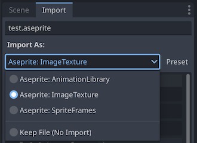
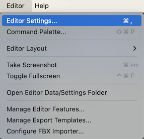
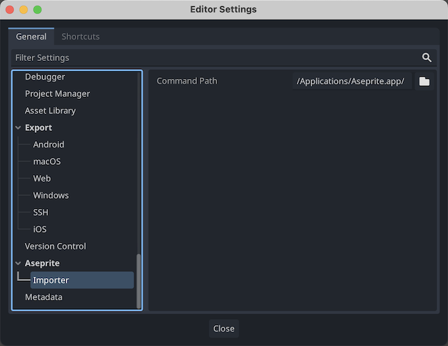

# Ase Import – Godot 4 Aseprite Importer Plugin

## Features

I want [Ase Import](https://github.com/RobRuana/ase_import) to:

- fit into my existing game dev workflows
- be friendly to collaborative team git workflows
- allow blending of manually created animations and imported animations
- just work

There are already a number of existing Aseprite importer plugins, but none of them fit all of my design goals, so here we are!

- Ase Import recognizes files with `*.ase` or `*.aseprite` file extensions
- Ase Import generates a bunch of resource files from a single `*.aseprite` file
- Ase Import can import an `*.aseprite` file as either:
    - `Texture2D` (default)
    - `AnimationLibrary`
    - `SpriteFrames`

- In each case, a call is made to the external [Aseprite executable file](#aseprite-command-path) to export spritesheets and JSON data with the given options
- Additional resources are derived from the exported images and JSON animation data

## Aseprite Command Path

You must set the Aseprite Command Path in Editor Settings to point to your where Aseprite program is installed. We try to guess where Aseprite is installed on your system, but this is not guaranteed to be correct.

- On Windows, this should point to the `Aseprite.exe` file, usually under `C:\Program Files\Aseprite\Aseprite.exe`
- On macOS, this should point to the `Contents/MacOS/aseprite` file INSIDE the `/Applications/Aseprite.app` bundle
- On Linux, this will be something like `/usr/local/share/bin/aseprite`

## ⚠️ Caveats ⚠️

- Ase Import is Godot 4 only
- You must have [Aseprite](https://www.aseprite.org) installed for the plugin to work
- The Godot editor is very aggressive about caching resources and resource previews, so after an import you may see some sprites that aren't updated in the editor. I have tried a number of ways to work around this issue; indeed, there are a [number](https://github.com/godotengine/godot/issues/30302) of [github issues](https://github.com/godotengine/godot/issues/24646) dealing with this. I have been unable to fix this issue.

## Import Options

### Spritesheet Options

| Option Name | Default | Description |
| :--- | :--- | :--- |
| spritesheets/per_layer | true | Generate a separate spritesheet for each layer |
| spritesheets/per_tag | false | Generate a separate spritesheet for each tag |
| spritesheets/include_hidden_layers | false | By default hidden layers are ignored |
| spritesheets/exclude_layers_pattern | "^_" | Exclude any layer matching the given regex |
| spritesheets/split_layers | false | Save each layer of each frame as separate images in spritesheet |
| spritesheets/sheet_type | "packed" | horizontal,vertical,rows,columns,packed |
| filename_pattern | "\{title\}-\{layer\}.\{extension\}" | Output filename |

### Frame Options

| Option Name | Default | Description |
| :--- | :--- | :--- |
| frames/trim | true | Trim surrounding transparent pixels from each frame |
| frames/exclude_trim_pattern | "" | Exclude images matching given regex from trimming |
| frames/border_padding | 0 | Add padding on the texture borders |
| frames/shape_padding | 0 | Add padding between frames |
| frames/inner_padding | 0 | Add padding inside each frame |
| frames/merge_duplicates | true | Merge all duplicate frames into one in the spritesheet |

### Animation Options

| Option Name | Default | Description |
| :--- | :--- | :--- |
| animation/fps_snap | -1.0 | Snap frame duration to given FPS |
| animation/invert_y | false | Invert Y coordinates (helpful for 3D) |
| animation/track_name_template | "\{layer\}" | Track name |

### Animate Position Options

| Option Name | Default | Description |
| :--- | :--- | :--- |
| animate_position/enabled | false | Animate `position` property instead of `offset` property |
| animate_position/include_pattern | ".\*Marker.\*" | Matching animation tracks will animate position property instead of offset |
| animate_position/pixel_scale | 0.05 | Position multiplier (should match `Sprite3D.pixel_scale`) |
| animate_position/use_vector3 | false | Use `Vector3` instead of `Vector2` for position property |

### Normal Maps Options

| Option Name | Default | Description |
| :--- | :--- | :--- |
| normal_maps/enable_generation | false | Generate normal map for spritesheet |
| normal_maps/exclude_pattern | "^_" | Exclude matching layers from normal map generation |

### Occluders Options

| Option Name | Default | Description |
| :--- | :--- | :--- |
| occluders/enable_generation | false | Generate light occluders for spritesheet |
| occluders/exclude_pattern | "^_" | Exclude matching layers from occluder generation |
| occluders/include_edges | false | Occluders extend to edge of opaque pixels in image |
| occluders/shrink | 0 | Pixels to shrink opaque areas in image (similar to erode filter) |
| occluders/grow | 0 | Pixels to grow opaque areas in image (similar to dilate filter, use with shrink to close small gaps) |
| occluders/post_shrink | 0 | Attempts to shrink generated occluder polygons by given number of pixels |
| occluders/post_grow | 0 | Attempts to grow occluder polygons by given number of pixels  |
| occluders/simplify | 0.1 | How much to simplify occluder polygons |
| occluders/convex_hull | false | Force convex occluder polygons, may generate multiple polygons for disconnected areas of sprite |
| occluders/single_hull | true | If true, merges all generated occluder polygons down to a single convex hull. Ignored if convex_hull is false |
| occluders/track_name_template | "\{layer\}_LightOccluder" | Occluder filename |

## Credits

This project contains code borrowed code from the following sources:

- [viniciusgerevini/godot-aseprite-wizard](https://github.com/viniciusgerevini/godot-aseprite-wizard)
- [hectorid/aseprite_importer](https://github.com/hectorid/aseprite_importer)

## License
[MIT License](LICENSE)
